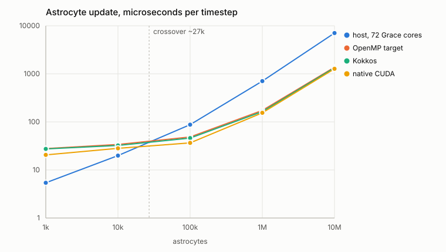

# astrosimgpu

Simulates a network of spiking neurons coupled to astrocytes, and measures
whether the astrocytes synchronise it.

It reimplements the model from:

> Jiang H-J, Aćimović J, Manninen T, Ahokainen I, Stapmanns J, Lehtimäki M,
> Diesmann M, van Albada SJ, Plesser HE, Linne M-L (2025).
> *Modeling neuron-astrocyte interactions in neural networks using distributed
> simulation.* PLOS Computational Biology 21(9): e1013503.
> <https://doi.org/10.1371/journal.pcbi.1013503>

The reference implementation is Python running on the NEST simulator, published
at <https://doi.org/10.5281/zenodo.13757202>. This one is standalone C++17 and
does not use NEST.

## What it does

Astrocytes are the non-neuronal cells of the brain. There is evidence that they
do not merely support neurons but shape how neuronal populations behave
together. This program simulates that interaction and measures the effect.

Each synapse in the network can recruit an astrocyte. The astrocyte receives
the presynaptic spikes, which raise its IP3 concentration and release calcium
from its internal stores. When that calcium crosses a threshold, the astrocyte
sends a slow inward current back to the postsynaptic neuron. Neurons drive
astrocytes, astrocytes drive neurons, and the question is what that loop does
to the network as a whole.

Run the default configuration:

```bash
./build/astrosimgpu --config config/use_case.json -t 120000
```

```
mean firing rate             0.4803 Hz
astrocytes with transients   64 / 100
mean pairwise correlation    0.0012
```

Neurons fire sparsely and irregularly. Astrocyte calcium transients occur, but
they are uncorrelated with each other.

Now change one number. `config/bursting.json` is identical except that the
neuron-to-astrocyte weight goes from 0.20 to 0.31:

```bash
./build/astrosimgpu --config config/bursting.json -t 120000
```

```
mean firing rate             0.6364 Hz
astrocytes with transients   100 / 100
mean pairwise correlation    0.3429
```

Every astrocyte is now active, and their calcium transients are strongly
correlated. The network has moved from asynchronous firing into synchronised
activity, and the only thing that changed is how strongly neurons drive
astrocytes. The feedback runs entirely through the astrocytic pathway.

Both runs take about a minute. `-t 120000` shortens the recorded window from
the configured five minutes; the transition is present either way.

The implementation also reproduces a published number. The paper reports a mean
firing rate of 4.76 spikes/s for its "Sparse" benchmark model; `config/paper_sparse.json`
gives 4.7445 Hz averaged over three seeds, an agreement of 0.33 %.

Reproducing both is what says the implementation is right.
`docs/validation.md` records it, together with the four errors found while
getting there and the things that remain unchecked.

## Status

The default build is CPU-only and needs nothing but a C++17 compiler.

An OpenMP target offload of the astrocyte update exists behind a build flag
that is off by default. It has been built with NVHPC and run on an NVIDIA
GH200, where it produces results identical to the host build. On the astrocyte
update alone it is faster than 72 Grace cores above about 40,000 astrocytes,
reaching 5.6x at ten million, and slower below that. That is one phase of the
simulation measured with the connectivity held almost constant; see "GPU
offload" below for what it does and does not establish.

## Why a second implementation

The reference implementation is the authority on the model. This one exists
because three things are awkward through the NEST Python interface:

1. **It builds with only a C++17 compiler.** No NEST, MPI, GSL, or conda
   environment.
2. **The numerics are explicit.** The integrator, time step and substepping are
   set in the configuration file rather than inside a simulator kernel.
   `docs/validation.md` shows why that matters: the results are not converged at
   the default step size.
3. **The data layout is prepared for GPU offload.** Populations are stored as
   structure-of-arrays and each cell update writes only its own element. The
   astrocyte update has already been restructured into device-callable free
   functions.

Use the reference implementation for published results. Use this one to
explore, to profile, or to experiment with the numerics.

## Build

```bash
make -j
```

To build with OpenMP:

```bash
make OPENMP=1 -j
```

Apple clang does not include OpenMP, so on macOS the default build is
single-threaded. The OpenMP pragmas are ignored and results are unchanged.

On Roihu, build from `roihu-gpu.csc.fi`, which is the ARM login node. Binaries
do not cross between the two login architectures. `docs/roihu.md` has the
details and `scripts/roihu/` has the build and batch scripts. The code builds
and passes all checks there with GCC 14.3.0 targeting Neoverse V2.

CMake is also supported:

```bash
cmake -S . -B build -DCMAKE_BUILD_TYPE=Release -DASTROSIMGPU_NATIVE=ON
cmake --build build -j
```

## Run

```bash
make test                                      # 86 component checks
./build/astrosimgpu --config config/quick.json # smoke test, about 0.3 s
./build/astrosimgpu --config config/use_case.json
```

Command line options:

```
-c, --config PATH     parameter file (JSON)
-o, --output DIR      output directory
-s, --seed N          random seed
-t, --sim-time MS     recorded duration
-p, --pre-time MS     discarded transient
-a, --astrocytes N    override the astrocyte count (random pools only)
    --threads N       OpenMP threads
    --no-analysis     skip the post-run summary
```

## Configurations

| File | Description |
|---|---|
| `config/use_case.json` | Block astrocyte pools, sparse asynchronous firing. Default. |
| `config/bursting.json` | Same, with a stronger neuron-to-astrocyte weight. The network becomes synchronised. |
| `config/no_spiking.json` | Neurons silent. Astrocytes receive only their own Poisson input. Control condition. |
| `config/random_pool.json` | Random astrocyte pools of five, lower recruitment probability, larger SIC weight. |
| `config/scale_1000.json` | Ten times larger, in-degree held constant so the regime is preserved. |
| `config/scale_1000_saturated.json` | Ten times larger with the connection probability fixed, so the network saturates. A throughput probe, not a model. |
| `config/kernel_scaling.json` | Fixed neuron population, astrocyte count set with `--astrocytes`. Isolates kernel throughput; most astrocytes are unconnected at large counts, so it measures one phase rather than a network. |
| `config/paper_sparse.json` | The reference "Sparse" benchmark model. Reproduces the published mean firing rate to 0.33 %. |
| `config/quick.json` | Small and short. For checking a build only. |

## GPU offload

The astrocyte update has been restructured so that it can run as an OpenMP
target region. This is the first step of the port described in
`docs/gpu-port.md`.

The per-cell code was moved out of `AstrocytePopulation` into free functions in
`include/astrosimgpu/astrocyte_kernel.hpp`. These take plain scalars only, with
no `this` pointer, no `std::vector`, and no reference into a class. A member
function cannot be offloaded, so this restructuring was needed before any
directive could be added. The random draws were moved to free functions in
`rng.hpp` for the same reason.

The host loop and the offloaded loop call the same `astro_advance` function.
Only the directive above the loop differs. The arithmetic is therefore covered
by the existing tests through the host path, and a test checks that
`rng_normal` matches `CounterRng` exactly.

To build with offload enabled:

```bash
make OFFLOAD=1 OFFLOAD_FLAGS="-mp=gpu -gpu=cc90" CXX=nvc++
```

Or with CMake, `-DASTROSIMGPU_OFFLOAD=ON` plus the offload flags for your
compiler.

A **Kokkos** backend for the same loop exists as an alternative, so the cost of
a portability layer can be measured against the directives rather than assumed.
It has not yet been compiled. See `docs/kokkos.md`.

```bash
cmake -S . -B build-kokkos -DASTROSIMGPU_KOKKOS=ON -DKokkos_ROOT=/path/to/kokkos
```

Every run reports which backend ran the astrocyte update, so a timing can
always be attributed.

### Measured on Roihu

Built with NVHPC 26.3 on the Grace ARM login node and run on one NVIDIA GH200
120GB. `-Minfo=mp` confirms the target region becomes a GPU kernel, parallelised
across teams and 128 threads, with the device routines generated for
`astro_advance`, `astro_derivatives` and the random number functions.

**Correctness.** All 86 component checks pass on the device, and the offloaded
run reproduces the host result exactly in every configuration tested.

**Throughput**, astrocyte update phase only, normalised per timestep. One
sweep, one build: host is 72 Grace cores built with nvc++, device is one GH200.

| astrocytes | host | device | |
|---|---|---|---|
| 100 | 4.0 us | 28.0 us | host 7.1x faster |
| 1,000 | 5.1 us | 29.3 us | host 5.8x faster |
| 10,000 | 13.0 us | 31.7 us | host 2.4x faster |
| 40,000 | 36.0 us | 36.2 us | even |
| 100,000 | 80.6 us | 45.2 us | device 1.8x faster |
| 1,000,000 | 805.1 us | 169.2 us | device 4.8x faster |
| 10,000,000 | 7,666.1 us | 1,370.8 us | device 5.6x faster |

Both costs are linear in the population above ten thousand cells, with a fixed
cost per step that dominates below it:

```
device  ~ 28 us + 0.133 ns per astrocyte
host    ~  4 us + 0.762 ns per astrocyte
```

The marginal figures hold from ten thousand astrocytes to ten million, so the
kernel itself is **5.7 times cheaper per astrocyte** than 72 Grace cores. At ten
million the measured ratio is 5.6, which is that asymptote reached.

**The two lines cross at about 40,000 astrocytes.** Below that the device is
launching a kernel over too few cells to cover its fixed cost; above it the
marginal advantage takes over. Per-GPU population sizes implied by
exascale-scale simulation are 10^5 to 10^6, where the measured advantage is
between 1.8x and 4.8x.

The device's 28 microsecond fixed cost is three device operations per step: the
input transfer, the kernel launch, and the calcium transfer back. Removing the
two transfers, by moving SIC delivery onto the device as well, would leave the
launch alone and should bring the crossover down to roughly ten thousand.

<picture>
  <source media="(prefers-color-scheme: dark)" srcset="docs/img/throughput-dark.svg">
  
</picture>

Regenerate with `python3 scripts/plot_throughput.py`, which reads
`docs/data/throughput.csv` and needs nothing but a Python interpreter.

### What this measurement does not cover

**Connectivity was held almost constant across the whole sweep.** The
configuration fixes the neuron population at 500, so every run from 100 to ten
million astrocytes had about 7,900 tripartite attachments. In the largest runs
almost every astrocyte was connected to nothing and simply integrated.

That was deliberate. It isolates the cost of the astrocyte update so the kernel
can be measured against the host without the delivery phases confounding it.
But it means the figures above describe **one phase of the simulation, not the
simulation**. A run of ten million connected astrocytes would not be 5.6 times
faster; only its update phase would be.

How much that matters depends on how the network is scaled, and the two
plausible choices disagree completely. At 1000 astrocytes and 5000 neurons on
the same hardware:

| | fixed connection probability | fixed in-degree |
|---|---|---|
| synapses | 5.0 M | 500 k |
| both update phases | 4.0 % | 97.6 % |
| delivery phases | 96.0 % | 2.4 % |

Under the first, offloading the update addresses 4 % of the run and caps the
achievable speedup near 1.04x. Under the second it addresses almost all of it.

At the scale this work is ultimately aimed at, the delivery phases are the
harder problem by a wide margin. Estimates put the human brain at 5 to 10 x
10^10 astrocytes. Spread over an exascale machine of order 10^4 GPUs that is a
few million astrocytes each, which the measurements above cover. The
connectivity is not covered:

```
synapses            ~ 10^11 neurons x 10^4 in-degree   = 10^15
tripartite attachments, at p_third ~ 0.5               = 5 x 10^14
per GPU, over ~2.4 x 10^4 GPUs                         ~ 2 x 10^10
at roughly 40 bytes per connection                     ~ 800 GB
```

Against 96 GB of device memory, before any cell state. Connectivity at that
scale cannot be stored on the device and would have to be regenerated from the
seed on demand, which the counter-based random numbers make possible in
principle but which nothing here does today.

So the kernel result is necessary and not sufficient. The open question is not
how fast the astrocyte update can be made, but what the continuous
astrocyte-to-neuron coupling costs when the connectivity is realistic.
`docs/experiments.md` sets out the experiment that would answer it.

Keeping the state resident on the device rather than mapping it every step is
what made these figures possible. Before that change the device cost 522
microseconds per step at one million astrocytes against 169 now, and the fixed
cost was 55 microseconds rather than 28.

### Limitations

1. **Off by default.** The default build contains no device code.
2. **Astrocyte only.** The neuron update is the larger phase in most
   configurations and is still host-only. It emits spikes, so the per-thread
   spike collection has to be reworked before it can be offloaded.
3. **State is mapped every step.** The data lifecycle has not been moved out of
   the timestep, which is what the measurements above are dominated by.

The restructuring was checked to reproduce the previous results exactly: mean
pairwise correlation 0.0106 in the asynchronous regime and 0.4177 in the
bursting regime, unchanged to four decimal places.

`docs/code-walkthrough.md` is a reading order through the source with the
reasoning behind the decisions that are not obvious from the code.

## Model equations

**Astrocyte** (Li & Rinzel 1994, extended by Nadkarni & Jung 2003). State
variables are `[Ca2+]`, `[IP3]` and `h_IP3R`:

```
d[Ca]/dt  = J_channel - J_pump + J_leak + J_noise
d[IP3]/dt = ([IP3]_0 - [IP3]) / tau_IP3 + delta_IP3 * J_syn(t)
dh/dt     = alpha_h (1 - h) - beta_h h

[Ca]_ER   = ([Ca]_tot - [Ca]) / r_ER,cyt
m_inf     = [IP3] / ([IP3] + Kd_IP3_1)
n_inf     = [Ca] / ([Ca] + Kd_act)
alpha_h   = k_IP3R Kd_inh ([IP3] + Kd_IP3_1) / ([IP3] + Kd_IP3_2)
beta_h    = k_IP3R [Ca]
J_channel = r_ER,cyt v_IP3R m_inf^3 n_inf^3 h^3 ([Ca]_ER - [Ca])
J_pump    = v_SERCA [Ca]^2 / (Km_SERCA^2 + [Ca]^2)
J_leak    = r_ER,cyt v_L ([Ca]_ER - [Ca])
```

Total calcium is conserved between cytosol and ER. Cytosolic calcium is
therefore held in the range `[0, Ca_tot]` after each step.

**SIC output.** The value is unitless. The pA unit comes from the
astrocyte-to-neuron weight:

```
F_SIC = SIC_scale * H(ln y) * ln y,    y = ([Ca] - SIC_th) / nM
```

`H` is the Heaviside function. No current is produced until calcium exceeds
the threshold by 1 nM.

**Neuron.** AdEx with alpha-shaped conductances and the astrocytic current:

```
C_m dV/dt = -g_L (V - E_L) + g_L Delta_T exp((V - V_th)/Delta_T)
            - g_ex (V - E_ex) - g_in (V - E_in) - w + I_e + I_stim + I_SIC
tau_w dw/dt = a (V - E_L) - w
```

When `V >= V_peak` the neuron spikes, `V` is set to `V_reset`, and `w` is
increased by `b`. Each conductance is an alpha function driven by a
two-variable cascade. It is normalised so that a spike of weight `W` gives a
peak conductance of `W` at one `tau_syn` after the spike arrives.

**Connectivity.** Neuron-to-neuron connections are drawn pairwise Bernoulli
with probability `p_primary`. Each connection then recruits an astrocyte with
probability `p_third_if_primary`. The astrocyte is taken from a pool assigned
to the postsynaptic neuron, either as a contiguous block or at random. A
recruited astrocyte receives the presynaptic spikes and sends a SIC to the
postsynaptic neuron.

## Output

CSV files are written to the configured output directory:

```
spikes.csv      time_ms,neuron
astrocytes.csv  time_ms,astrocyte,Ca,IP3
neurons.csv     time_ms,neuron,V_m,I_SIC
run.txt         network sizes, timings, and the calcium summary
```

`scripts/plot_results.py <dir>` produces a spike raster, the population firing
rate, and calcium traces. It requires numpy and matplotlib. The simulator does
not require either.

At the end of a run the program reports the number of astrocytes that produced
calcium transients, the mean transient duration, and the mean pairwise
correlation between transient onsets. The last of these is the measure of
astrocyte-supported synchronisation used in the reference analysis.

## Repository layout

```
include/astrosimgpu/   headers: cell models, network, analysis, config, RNG
src/                   implementation and command-line front end
config/                parameter sets, one per regime
tests/                 component tests, no external framework
scripts/               plotting, NEST default dump, Roihu build and baseline
docs/                  code walkthrough, validation, GPU port plan, Roihu notes
```

## Performance profile

Each run reports wall-clock time split by phase. The phases match the
decomposition used in the reference benchmarks (update, spike delivery, SIC
gathering and delivery), so the two profiles can be compared.

**A single profile number is misleading.** The split depends on the machine and
much more strongly on how the network is scaled. `config/use_case.json`, 60 s
of model time:

| phase | 1 core, x86 | 72 Grace cores |
|---|---|---|
| update astrocytes | 4.3 % | 26.4 % |
| update neurons | 92.5 % | 60.5 % |
| everything else | 2.3 % | 13.1 % |

The astrocyte update takes a larger share on Grace because there are only 100
astrocytes: across 72 threads that is 1.4 cells per thread, and thread dispatch
costs more than the work.

Network size matters more than the machine does. At 1000 astrocytes and 5000
neurons, on the same 72 Grace cores:

| | 100 astro, 500 neurons | 1000 / 5000, fixed p | 1000 / 5000, fixed in-degree |
|---|---|---|---|
| synapses | 50 k | 5.0 M | 500 k |
| both update phases | 86.9 % | 4.0 % | 97.6 % |
| everything else | 13.1 % | 96.0 % | 2.4 % |

Scaling the population while holding the connection probability fixed
multiplies each neuron's input by the same factor, and the delivery phases come
to dominate. Holding the in-degree fixed keeps the operating point and leaves
the update phases dominant. The reference benchmarks scale with a fixed
probability, which is why their delivery phases grow with scale.

Whether offloading the update is worth anything therefore depends on which
scaling the science uses. `docs/gpu-port.md` works through the consequences and
`docs/experiments.md` lists what is being measured next.

## Parameter sources

The following come from the reference model's parameter file and the
regime-specific settings in its driver script:

- Fitted astrocyte parameters: `Ca_tot`, `IP3_0`, `tau_IP3`, `delta_IP3`
- Neuron parameters
- Synaptic weights and delays
- Connectivity probabilities
- Input rates

Remaining astrocyte parameters use the `astrocyte_lr_1994` defaults. Remaining
neuron parameters use the `aeif_cond_alpha_astro` defaults.

**One parameter is easy to get wrong.** The reference parameter file lists
`tau_syn_ex` and `tau_syn_in` under its synaptic parameters, both set to 2 ms.
These are passed to the Tsodyks synapse as `tau_psc`. They are not applied to
the neuron. The neuron keeps the `aeif_cond_alpha_astro` defaults of 0.2 ms and
2.0 ms. Using 2 ms for the neuron's excitatory conductance increases the mean
excitatory drive by a factor of ten and changes the network regime. Both values
are therefore stated explicitly in the neuron configurations here.

**Two properties of the background noise also matter and are not visible in the
parameter file.** NEST's `noise_generator` gives each target an independent
current, and holds that current constant for `dt`, which defaults to ten times
the resolution. Drawing a new value every step reduces the membrane potential
fluctuation by about a factor of sqrt(10). With these parameters that is enough
to stop the excitatory population from firing.

The remaining defaults were taken from the NEST source code, not from a running
installation. Verify them before making a quantitative comparison:

```bash
python scripts/dump_nest_defaults.py > nest_defaults.json   # requires NEST
```

Then compare against `config/use_case.json`. One value, `delta_IP3`, could not
be confirmed. Every configuration in this repository sets it explicitly.

## Differences from the reference implementation

The two simulators should agree statistically. They will not produce identical
traces.

1. **Integration.** Fixed-step RK4 with configurable substeps, rather than the
   adaptive GSL RKF45 solver NEST uses. The linear conductance cascade is
   propagated exactly instead of through the RK stages. Increase `substeps` to
   check whether a result depends on the step size.
2. **Short-term plasticity.** Implemented in the published Tsodyks-Markram
   form. NEST's `tsodyks_synapse` update order has not been compared against it
   line by line, though the benchmark firing rate agreeing to 0.33 % suggests
   the aggregate behaviour matches. Set `synapse.stp.enabled` to `false` for
   static weights.
3. **Random numbers.** A different generator, so the same seed gives a
   different noise realisation. Runs are reproducible within this simulator
   only.
4. **Background noise.** Independent current per target, piecewise constant
   over `noise_dt`, defaulting to ten times the resolution. This matches NEST.
5. **Duplicate SIC connections are kept.** The third-factor rule attaches one
   astrocyte per primary connection, and the same astrocyte can be attached
   several times to the same target neuron. With the default parameters each
   neuron connects to its astrocyte about sixteen times. Removing the
   duplicates divides the slow inward current by the same factor. Set
   `connectivity.unique_third_out` to compare.
6. **No distributed execution.** Threads within one process only. There is no
   MPI support. Use the reference implementation for distributed runs.

## Licence

GPL-3.0. The model, its fitted parameters, and the analysis procedures come
from the reference implementation, which is GPL-3.0.

## References

- Jiang H-J *et al.* (2025) PLOS Comput Biol 21(9): e1013503.
- Li YX, Rinzel J (1994) *Equations for InsP3 receptor-mediated [Ca2+]i
  oscillations derived from a detailed kinetic model.* J Theor Biol
  166:461-473.
- De Young GW, Keizer J (1992) PNAS 89:9895-9899.
- Nadkarni S, Jung P (2003) Phys Rev Lett 91:268101.
- Brette R, Gerstner W (2005) *Adaptive exponential integrate-and-fire model.*
  J Neurophysiol 94:3637-3642.
- Tsodyks M, Uziel A, Markram H (2000) J Neurosci 20:RC50.
