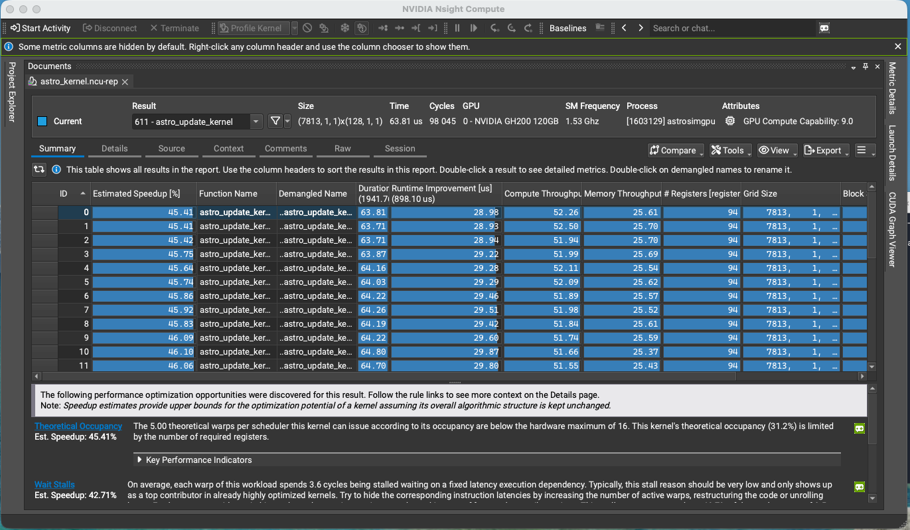
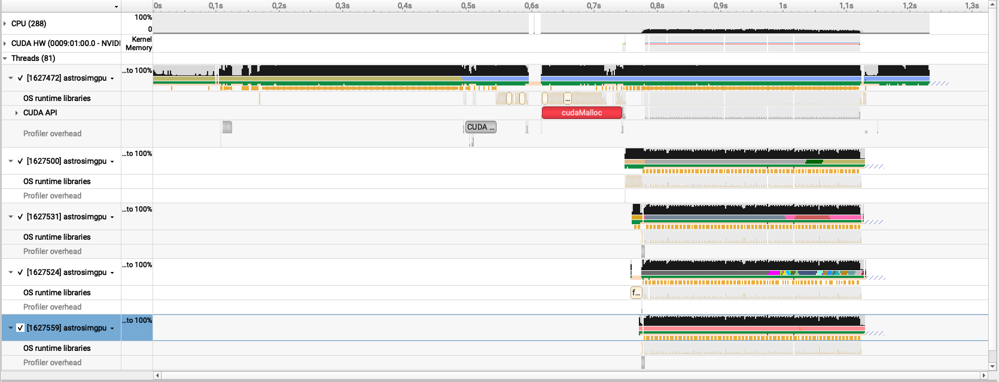
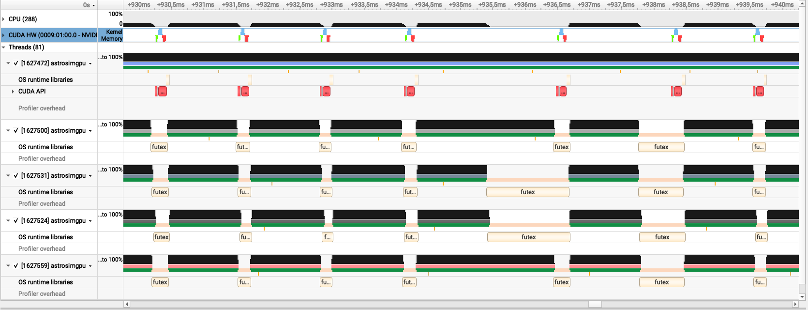

# Profiling on Roihu

The throughput table in `docs/data/throughput.csv` says the astrocyte phase costs
155 us per step at a million cells. It does not say what that time is spent on.
Two profilers answer different halves of that question: Nsight Compute measures
one kernel in detail, Nsight Systems measures where the step goes in time.

Both were run against `config/kernel_scaling.json` at 1,000,000 astrocytes on one
GH200, native CUDA build.

## Method

```bash
# One kernel, in detail. --set full replays each launch about 40 times, so keep
# the run short and do not read timings from it.
ncu --set full -k regex:astro -o astro_kernel \
    ./build-cuda/astrosimgpu --config config/kernel_scaling.json \
    --astrocytes 1000000 -t 2 -p 1 -o /tmp/ncu

# The whole step, in time. No replay, so this runs at normal speed.
nsys profile -o astro_timeline --stats=true \
    ./build-cuda/astrosimgpu --config config/kernel_scaling.json \
    --astrocytes 1000000 -t 20 -p 5 -o /tmp/nsys
```

Both tools run Python for their report processing. On Roihu that fails with
`unknown encoding: utf-8-sig` unless user site-packages are skipped, so prefix
either command with `PYTHONNOUSERSITE=1`.

The reports themselves are not committed. The Nsight Compute report is 76 MB and
the Nsight Systems one 8.4 MB, and both regenerate from the commands above. The
`.sqlite` file that `nsys` writes alongside its report can be queried directly
with `sqlite3`, which is how the numbers below were extracted.

## The kernel is limited by registers



Every launch reports the same shape, and the numbers barely move across the
thirty that were profiled.

| | |
|---|---|
| registers per thread | 94 |
| blocks per SM allowed by registers | 5 |
| blocks per SM allowed by anything else | 16 to 32 |
| theoretical occupancy | 31.25 % |
| achieved occupancy | 28.62 % |
| active warps per scheduler | 4.57 of 16 |
| eligible warps per scheduler | 0.89 |
| cycles with no eligible warp | 46.92 % |

At 94 registers a block of 128 threads needs about 12,000 of the SM's 65,536
registers, so five blocks fit and twenty warps of a possible sixty-four are
resident. Achieved occupancy sits close to theoretical, so nothing is being lost
to imbalance or to a tail: the ceiling is the allocation itself.

Twenty warps are not enough to hide FP64 latency through an RK4 stage sequence,
where each stage depends on the one before it. The largest single stall is a
fixed-latency execution dependency at 3.6 of the 8.6 cycles between issues, 42 %
of the total.

The kernel reaches 37 % of the device's FP64 peak and 50.89 % SM throughput.

Several plausible explanations are ruled out by the same report:

- **not spilling**, local memory spilling requests are zero, so the 94 registers
  are live state rather than thrashing
- **not divergence**, branch efficiency is 100 % with no divergent branches
- **not bandwidth**, DRAM throughput is 25.37 % and memory pipes are 11.53 % busy
- **not a tail**, there are 11.84 waves per SM

This answers open questions 1 and 4 in `docs/gpu-port.md` for the astrocyte
kernel. One thread per cell holds its state in registers without spilling, and
the cost of doing so is that only five blocks fit per SM.

## The device is idle most of the step



Over the 372 ms during which the device does anything at all:

| | time | share |
|---|---|---|
| kernel | 14.02 ms | 3.8 % |
| transfers | 18.44 ms | 5.0 % |
| idle | 339.57 ms | 91.3 % |

Consecutive kernels are 1,438 us apart on average, with a minimum of 1,181. The
astrocyte work inside that gap is about 130 us.



Zoomed to ten milliseconds, each step is the same three device operations
followed by a long silence: a Host-to-Device transfer, the kernel, a
Device-to-Host transfer.

| operation | per step |
|---|---|
| Host-to-Device transfer | 23.3 us |
| `astro_update_kernel` | 56.1 us |
| Device-to-Host transfer | 49.2 us |
| `cudaLaunchKernel` on the host | 5.7 us |
| host blocked in `cudaMemcpy` | about 147 us |

The kernel measures 56.1 us here against 64.7 us under Nsight Compute. Nsight
Compute flushes caches between replay passes by default, so its figure is a
cold-cache one and this is the closer estimate of what the kernel costs in place.

### The transfers move whole arrays

All 510 transfers are exactly 8,000,000 bytes, which is the full population array
of doubles, in both directions, on every step. In this configuration 7,883
astrocytes have a connection to a neuron and the rest have none, so under one
per cent of what crosses the bus is read.

Residency, recorded in `docs/gpu-port.md`, cut this from five arrays to two. It
did not make either of the two smaller.

The Device-to-Host transfer is also unconditional. `deliver_sic` runs every
`synapse.sic_interval` steps, and `docs/experiments.md` records that an interval
of ten leaves the dynamics unchanged. At that interval nine of every ten
transfers back are already known to be unnecessary.

### The gap is host work

`drive_astrocytes` in `src/network.cpp` is a serial loop over every astrocyte,
drawing a Poisson variate for each, on every step. It carries no OpenMP
directive. The phase timings printed at the end of a run put it at roughly 720 us
per step at this size, against 56 us for the kernel it feeds.

That accounts for about half the 1,438 us gap. The rest is the neuron update, the
delivery phases and recording, none of which have been separated on the timeline.

The trace does not name any of this by itself. It shows the gap and the phase
counters attribute it, which is weaker than measuring it directly. Wrapping each
phase in NVTX ranges would put labelled bars on the timeline and settle it.

## What follows

In the order the measurements support, not the order of difficulty.

1. **Annotate the phases with NVTX ranges.** Small, and every profile after it
   explains itself. It also converts the attribution above from inference into
   measurement.

2. **Parallelise `drive_astrocytes`, then move it to the device.** The loop is
   per-cell with no communication, and `CounterRng` carries no state between
   cells, so it is already in the shape a kernel wants. Generating the input on
   the device also removes the Host-to-Device transfer entirely, because the
   input would no longer be assembled on the host, and `clear_inputs` with it.

3. **Stop returning calcium every step.** Gating the transfer on
   `synapse.sic_interval` is small and follows directly from the interval result.
   Moving SIC generation onto the device removes the transfer and the host
   synchronisation that goes with it, and is the change that matters at scale,
   where the connected fraction is not small and transferring less would not
   help.

4. **Reduce register pressure.** A sweep of `-maxrregcount` from 94 down through
   64 and 48 costs no source change and would show whether occupancy or spilling
   wins. Single precision is the other route, and would cut register pressure as
   well as arithmetic cost, since a double occupies two registers. That makes the
   precision question in `docs/experiments.md` more valuable than it looked when
   it was written, and it is measured against the regime transition rather than
   by eye.

Items 1 to 3 address 1,382 us of the 1,438. Item 4 addresses 56.

## What this does not change

The four backends in `docs/data/throughput.csv` were measured on the same phase
by the same harness, so the comparison between them and the crossover figures
stand.

It does change how that table should be read. 155 us per step is the astrocyte
phase, and at a million astrocytes the phase is roughly a tenth of the step. The
table measures one kernel and its transfers, which is what it was built to do,
and not the cost of a simulation.
